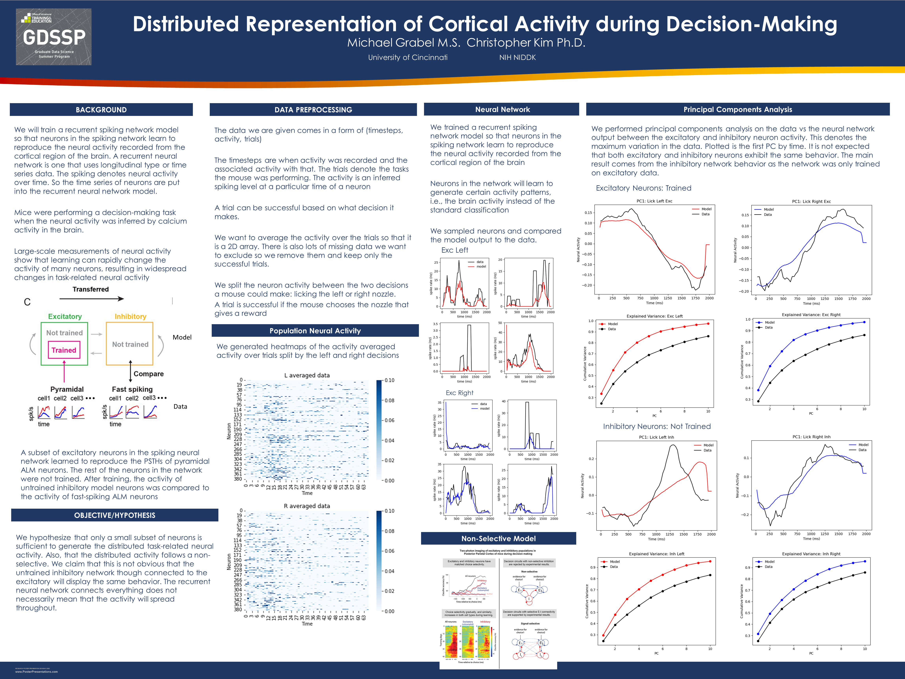

# Publications

**Abstracts**

Grabel MZ, Vaughan BL, Dexheimer JW, Kirkendall ES. A Mathematical Model for Computer-Assisted Modification of Medication Dosing Rules. [Abstract] *Ohio Journal of Science*, 117 (1), 29. 2017. Print. DOI: [http://dx.doi.org/10.18061/ojs.v117i1.5770](http://dx.doi.org/10.18061/ojs.v117i1.5770) 

Shaikh, Hira Ghazal, et al. Survival outcomes of post-transplant lymphoproliferative disorder: A 12-year analysis. *Journal of Clinical Oncology* 39, 2021 (suppl 15; abstr e19543) DOI: 10.1200/JCO.2021.39.15\_suppl.e19543
[https://meetinglibrary.asco.org/record/199988/abstract](https://meetinglibrary.asco.org/record/199988/abstract)

**Articles**

Grabel MZ, Vaughan BL, Dexheimer JW, Kirkendall ES. Mathematical Model for Computer-Assisted Modifications of Medication Dosing Rules. *Journal of Biomedical Informatics Insights*. Print. DOI: [https://doi.org/10.1177/1178222619829079](https://doi.org/10.1177/1178222619829079)

**Artciles under Review**

Grabel M, Changizi B, Merola A. Pallidal Deep Brain Stimulation for Tardive Syndromes: A Meta Analysis of Clinical Outcomes. *Journal of Neurology*

**Masters Thesis**

Grabel, Michael Z. A Lagrangian/Eulerian Approach for Capturing Topological Changes in Moving Interface Problems. 2019
[https://etd.ohiolink.edu/apexprod/rws_olink/r/1501/10?clear=10&p10_accession_num=ucin1563527241172213](https://etd.ohiolink.edu/apexprod/rws_olink/r/1501/10?clear=10&p10_accession_num=ucin1563527241172213)

# Presentations

Distributed Representation of Cortical Activity during Decision-Making [Poster Presentation]  
*National Institutes of Health Summer Poster Day* $~~~~~~~~~~$ 4 Aug 2022  

Pallidal Deep Brain Stimulation for Tardive Syndromes: A Meta Analysis of Clinical Outcomes  
*Biostatistics and Bioinformatics Seminar, University of Cincinnati* $~~~~~~~~~~$ 21 Jan 2022  

Mathematical Model for Computer-Assisted Modification of Medication Dosing Rules  
*Biostatistics and Bioinformatics Seminar, University of Cincinnati* $~~~~~~~~~~$ 9 Oct 2020  

A Lagrangian/Eulerian Approach for Capturing Topological Changes in Moving Interface
Problems  
*Graduate Student Seminar, University of Cincinnati* $~~~~~~~~~~$ 12 Sep 2019  

Level Set and Fast Marching Methods: An Introduction to Theory of Moving Interfaces  
*Graduate Student Seminar, University of Cincinnati* $~~~~~~~~~~$ 13 Sep 2017

A Mathematical Model for Computer-Assisted Modification of Medication Dosing Rules
[Poster Presentation]   
*Ohio Academy of Science 126th Annual Meeting at the University of Cincinnati* $~~~~~~~~~~$ 8 Apr 2017  

# Posters
  

  

# Research
