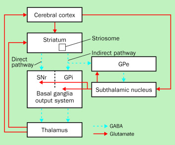
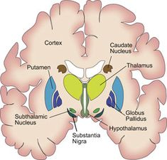
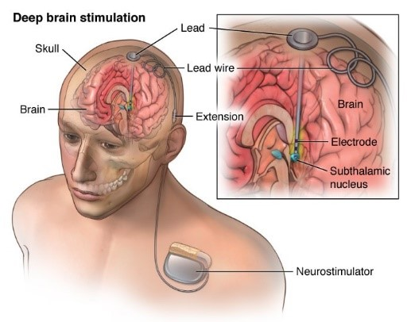

I have a neurological movement disorder called Tourette's Syndrome. It is a difficult and complex disorder. People are born with this disorder and it is lifelong. The onset of symptoms occur anywhere between the ages of 3 to 7 years old. It is also 3 times more likely to occur in males than in females. Tics vary from person to person and the severity ranges from mild to severe. Tics also wax and wane. It is hardly ever constant. Stress, anxiety, and even excitement can trigger an increase in tics. Symptoms are usually most severe during puberty and usually dies out in adulthood. It is rare to see it continue so severely into adulthood like me but I am a rare creature.   

I hope this information is informative for you. I generally like to educate others on what it is but then I do not want to think about it again. I am highly functional as a person with TS if I am not directly thinking about the tics so if they are brought up more tics will come out. You can of course ask questions about it but it is usually good to just ignore the tics and slowly filter them out of your mind much like I do and continue working. It helps to know that you know what it is.

# Symptoms:  
**Tics** - involuntary, rapid or sudden movements or vocalizations that occur repetitively   

### Types of Tics:  
- **Motor Tics** - Involuntary movements such as eye blinking, facial grimacing, and neck jerking   
- **Vocal Tics** - Involuntary sounds or vocalizations  
- **Tics of the Mind** - Difficult to define and distinguish from cognitive OCD. Just as a simple motor tic can occur this occurs in the mind in some similar fashion  

### Subtypes:  
- **Simple Tics** - usually sudden, fast, brief, and meaningless movements that involve a specific muscle group   
  - Examples: eye blinking, facial grimacing, head and neck jerks, throat clearing, spitting, and grunting  
- **Complex Tics** - usually a cluster of movements that appear coordinated.  
  - Examples: clapping, touching something or someone in some fashion, hitting oneself, or complex facial expressions.

#### Uncommon or Rare Complex Tic Types:  
- **Echopraxia** - involuntary imitation or repetition of some action seen or observed  
- **Echolalia** - involuntary imitation or repetition of something that is spoken or heard  
- **Palipraxia** - involuntary repetitions of ones own movements  
- **Palilalia** - involuntary repetition of ones own speech  
- **Copropraxia** - involuntary performing obscene gestures  
- **Coprolalia** - involuntary vocalizations where one blurts out obscenities*  

*I do not have any of these types of tics but they exist out there. The media in particular likes to focus in on Coprolalia and make fun of it and misdirect people into thinking this is what Tourette's is when less than 10% of TS patients have this symptom. 

### Comorbidities:
- **OCD** - Obsessive Compulsive Disorder: a disorder in which people have recurring, unwanted thoughts, ideas or sensations (obsessions) that make them feel driven to do something repetitively (compulsions)  
- **ADHD** - Attention-Deficit Hyperactivity Disorder: a disorder where one cannot maintain focus on any one thing for long  
- **MDD** - Major Depressive Disorder: characterized by persistently low mood or loss of interest in activities  
- **GAD** - Generalized Anxiety Disorder: characterized by persistent and excessive worry about a number of different things  

There are likely others but these are at least the most common. I personally have OCD in addition to TS. These comorbidities can feed into each other making a truly horrible combination. For example obsessively worrying about how other people are perceiving you and your tics and bringing on a sense of doom if I do not do something feeds into the urge to tic and more tics come about because I am anxious. 

### Diagnostic Criterion:
- having at least one motor and one vocal tic occurring for at least one year before the age of 18 with symptoms not explained by any other medical condition

# Causes
- There is no known definite cause and there is no cure  
- misfiring neurons in a highly specialized and complex motor system called the Basal Ganglia (BG)  
- There is a genetic factor or a highly hereditary disorder  

# Neuropathophysiology

### Cortico-Basal Ganglia Thalmocortical Pathways (CBGT)
These pathways are directions for brain signals from the cortex to go into the BG and providing output back to the cortex  
- **Direct** - positive feedback loop that facilitates movement  
- **Indirect** - negative feedback loop that inhibits movement  
- **Hyperdirect** - also negative feedback loop but bypasses an input structure in the brain. This too inhibits movement  

#### Important Anatomical Structures
- **STN** - Sub-Thalamic Nucleus 
- **GPi** - Globus Pallidus interior
These areas of the brain are significantly involved in the pathways of neural signals in the BG

   

- The direct pathway activates desired movements and actions coming from the cortex where we decide what we want to do
- The other two pathways suppress any unwanted competing movements
- Therefore, selected movements are enabled and competing movements are prevented from interfering with the one selected
- However; anatomical evidence points out that these circuits are far more complex than this
- In the pathophysiology of TS structural changes in the BG have been reported in a broad range of these cortical areas in the brain
- Various neuroimaging studies have shown reduced volumes and abnormal asymmetries of the caudate nucleus, putamen, and globus pallidus
- Studies have also shown that in patients with TS there are abnormal grey matter volumes (neuronal cell bodies, dendrites, glial cells, and synapses) and other abnormalities in white matter (mylinated axons, how action potentials are propagated)
- Errors in the inhibition of unwanted competing movements can lead to tics.
- In TS, this unwanted inhibition of the main output nuclei of the BG leads to disinhibition (an increase in strength of the stimulus of an unrelated extinguished response) of its thalamocortical targets and thus in turn can lead to repeated stereotyped unwanted movements like tics 
- Mechanisms that can be responsible for such an unwanted activation are:
  - excessive cortical or thalamic input to the striatum (primary input to the BG)
  - deficiency of intrastriatal inhibition
  - abnormal dopamine transmission
  - abnormal membrane excitability 

Many features of TS can be explained as a failure to inhibit unwanted movements, behaviors, and thoughts resulting from these abnormal BG output patterns. For example, abnormal activation of the motor cortex can produce simple tics, and abnormal activation of the premotor cortex can lead to complex tics. 

In summary input signals are coming from the cortex go to the striatum to the basal ganglia taking either the direct or indirect pathway filtering out some movement and outputs back to the motor cortex where the body produces physical movement. When these signals misfire so to speak tics are produced.

#### Dopaminergic Neurotransmitter System
- **Dopaminergic Neurons** - neurons that activate based on dopamine  
- In the BG these neurons overall enhances the thalamacortical excitation  
- Abnormalities in this system seems to play a significant role in TS
- Studies show these abnormalities in the striatum
- This is why medications that are dopamine antagonists usually supress tics
  - **antagonist** is one that blocks the neurotransmitter in the neuron
  

Much more research is needed on the pathophysiology of this disorder. Most current research is focused on the genetic factor that would lead to these structural changes. With the rise of bioinformatics and computational systems biology we could see further results 

# Treatments
- There is no medication specifically for TS
- Medications are prescribed based on what might aid tic reduction in the circuitry
- Doctors go-to medications are neuroleptics or anti-psychotics, which are dopamine antagonists
  - e.g. Haldol or Risperdal
  - Horrible side effects: Sedation, weight gain, dizziness, nausea, fatigue, depression, and insomnia
- Doctors also resort to off label use of other medications: Guanfacine or Clonodine; these are approved for the use in treating high blood pressure but not TS
- Other medications: Benzodiazpine's like Xanax, Ativan or Klonopin
- SSRI's or Selective Serotonin Reuptake Inhibitors such as fluoxetine, sertraline, and fluvoxamine. Targets serotonin systems over dopamine
- SNRI's or Serotonin-Norepinephrine reuptake inhibitors such as Venlafaxine or Effexor. Targets norepinephrine (another neurotransmitter) in addition to serotonin 
- Nicotine Patches
- Cannabinoids like marijuana or cannabidiol (CBD)

#### Behavioral Interventions
- CBT or Cognitive Behavioral Therapy: working with a psychologist on isolating a specific behavior or even a tic to change how you cognitively, emotionally, and physically react or respond to it. 
- CBIT or Comprehensive Behavioral Intervention for Tics: more specialized version of CBT, not many psychologists are trained in using it, It involves giving a competing response to tics, which involves becoming particularly aware of how and when you tic, and redirecting the tic to a competing response behavior. e.g. I have a tic where I hit myself in the face if I want to reduce that tic I would have a competing response, any time I had the urge to slap my face I would instead redirect the tension to move my arm outward. This is incredibly difficult if not impossible in some cases because tics cannot be controlled it is involuntary it just happens.But this training can be useful in treating tics and helping your quality of life

#### Deep Brain Stimulation (DBS) Surgery
- Involves the implantation of a neurostimulator or leads into a particular area of the brain in the BG
- the neurostimulator or a lead has four contact points on it that sends out charges or stimulation based on the parameters of stimulation programmed by a neurologist
- The settings of these parameters are housed in a battery pack that is put typically in your chest and is connected to the brain stimulators
- Settings to be adjusted:
  - voltage current or amplitude: the amount of charge given, usually very high charges are good for tics
  - pulse width: the length of time the charge is given
  - frequency: how often the charge is given

- There are two modes a particular contact point on a lead can take:
  - Monopolar Stimulation: the contact point acts as an anode or a positively charged area thus giving charge to the brain. More spherical in shape
  - Bipolar Stimulation: One contact point acts as an anode and another contact point as a cathode or taking charge away thus giving a stimulation structure that at one level is giving charges and at another is sucking up charge. More elliptical in shape
  
  
DBS is most popularly done in Parkinson's Disease Patients but its uses are being explored for other disorders.

##### Targets for DBS in patients with TS
- GPi - Globus Pallidus interior
- STN - Sub-Thalamic Nucleus 

More generally the substructures of the BG are targeted.  
- DBS creates a functional ablation or lesion, which reduces information flow through the stimulated nucleus  
- In theory if the targeted location is correct in DBS, the lesioning out the misfirings of TS may result in a significant reduction in tics   

  

I personally have undergone DBS 5 times in the past 10 years. That is 4 too many or maybe 5. The reasons for this are complicated  

Here is the youtube video I made which covers a lot of this stuff listed here but I also go into more of my personal experience:

<iframe width="560" height="315" src="https://www.youtube.com/embed/RCMCBQZ0zko" title="YouTube video player" frameborder="0" allow="accelerometer; autoplay; clipboard-write; encrypted-media; gyroscope; picture-in-picture" allowfullscreen></iframe>

## References:
[Tourette Association of America](https://tourette.org/about-tourette/overview/what-is-tourette/)  

James F Leckman, Tourette's syndrome, *The Lancet*, Vol 360(9345), 2002 DOI: [https://www.thelancet.com/journals/lancet/article/PIIS0140-6736(02)11526-1/fulltext](https://www.thelancet.com/journals/lancet/article/PIIS0140-6736(02)11526-1/fulltext)

Joseph Jankovic, Tourette syndrome, *orphanet*, [https://www.orpha.net/data/patho/GB/uk-tourette.pdf](https://www.orpha.net/data/patho/GB/uk-tourette.pdf)

Smeets, A. Y. J. M. (2018). New insights in deep brain stimulation for Tourette syndrome. Datawyse / Universitaire Pers Maastricht. [https://doi.org/10.26481/dis.20180601as](https://doi.org/10.26481/dis.20180601as)

